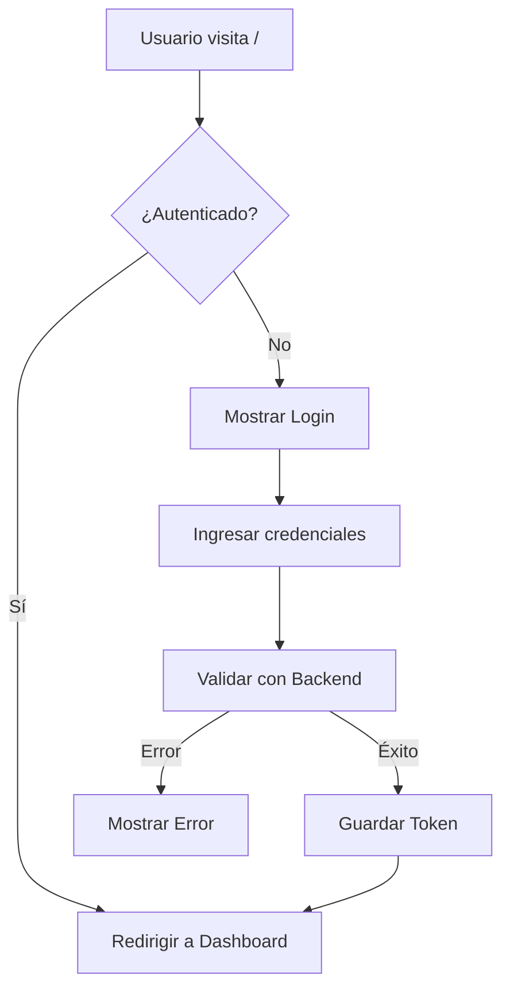
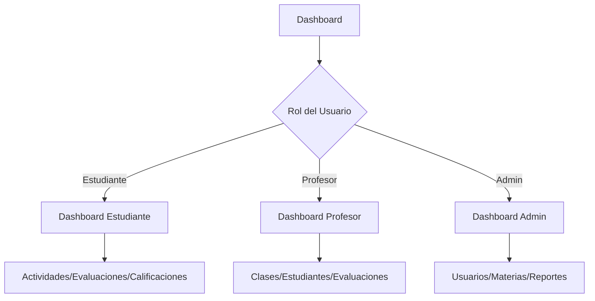

# 🎓 Estud_IA - Plataforma Educativa Inteligente

Una aplicación web moderna para la gestión educativa con inteligencia artificial, diseñada para facilitar el aprendizaje interactivo y la administración académica.

## 📋 Tabla de Contenidos

- [Descripción](#descripción)
- [Características Principales](#características-principales)
- [Arquitectura](#arquitectura)
- [Instalación](#instalación)
- [Configuración](#configuración)
- [Uso](#uso)
- [Roles y Permisos](#roles-y-permisos)
- [Flujo de la Aplicación](#flujo-de-la-aplicación)
- [Estructura del Proyecto](#estructura-del-proyecto)
- [Tecnologías Utilizadas](#tecnologías-utilizadas)
- [API Endpoints](#api-endpoints)
- [Contribución](#contribución)
- [Licencia](#licencia)

## 📖 Descripción

Estud_IA es una plataforma educativa integral que conecta estudiantes, profesores y administradores en un entorno digital colaborativo. La aplicación utiliza inteligencia artificial para personalizar el aprendizaje, automatizar evaluaciones y proporcionar análisis detallados del rendimiento académico.

## ✨ Características Principales

### 🎓 Para Estudiantes

- **Dashboard Personalizado**: Vista centralizada de actividades y progreso
- **Evaluaciones Interactivas**: Quiz y pruebas con retroalimentación inmediata
- **Seguimiento de Calificaciones**: Acceso en tiempo real a notas y rendimiento
- **Actividades Educativas**: Contenido multimedia y ejercicios adaptativos
- **Control de Asistencia**: Registro automático y visualización de asistencia

### 👨‍🏫 Para Profesores

- **Gestión de Clases**: Creación y administración de cursos
- **Evaluaciones con IA**: Generación automática de preguntas y corrección
- **Seguimiento de Estudiantes**: Monitorización individual y grupal
- **Control de Asistencias**: Registro y análisis de asistencia
- **Actividades Personalizadas**: Creación de contenido educativo adaptativo

### 🛠️ Para Administradores

- **Gestión de Usuarios**: Administración de cuentas y permisos
- **Gestión de Materias**: Configuración del catálogo académico
- **Reportes y Analíticas**: Análisis detallados del rendimiento institucional
- **Configuración del Sistema**: Parámetros y ajustes globales

## 🏗️ Arquitectura

### Arquitectura de Componentes

```
App
├── AuthProvider (Contexto de Autenticación)
├── Router (React Router)
├── Layouts
│   ├── DashboardLayout (Layout principal para usuarios autenticados)
│   └── AuthLayout (Layout para páginas públicas)
├── Components
│   ├── Navbar (Navegación responsiva)
│   ├── Sidebar (Menú lateral por rol)
│   └── PrivateRoute (Protección de rutas)
└── Pages (Vistas por rol)
```

### Flujo de Autenticación

1. **Login**: Usuario ingresa credenciales → Validación en backend → Token JWT
2. **Almacenamiento**: Token y datos de usuario en localStorage
3. **Verificación**: Cada petición incluye token en headers
4. **Autorización**: PrivateRoute valida roles y permisos

## 🚀 Instalación

### Prerrequisitos

- Node.js (v18 o superior)
- npm o yarn
- Backend API corriendo (ver documentación del backend)

### Pasos de Instalación

1. **Clonar el repositorio**

```bash
git clone <repositorio-url>
cd frontend
```

2. **Instalar dependencias**

```bash
npm install
```

3. **Configurar variables de entorno**

```bash
cp .env.example .env
# Editar .env con la configuración del backend
```

4. **Iniciar servidor de desarrollo**

```bash
npm run dev
```

5. **Acceder a la aplicación**

```
http://localhost:5173
```

## ⚙️ Configuración

### Variables de Entorno

```env
VITE_API_URL=http://localhost:3000/api/v1
VITE_APP_NAME=Estud_IA
VITE_APP_VERSION=1.0.0
```

### Configuración de Backend

Asegúrate de que el backend esté corriendo en la URL configurada. La aplicación espera:

- Endpoint de autenticación: `/api/v1/login`
- Token JWT para autenticación
- CORS configurado para el dominio del frontend

## 🎯 Uso

### Flujo Básico de Usuario

1. **Registro/Login**
   - Nuevo usuario: `/register` → Seleccionar rol → Completar formulario
   - Usuario existente: `/login` → Ingresar credenciales

2. **Dashboard Principal**
   - Acceso según rol: `/dashboard`
   - Navegación contextual basada en permisos

3. **Navegación**
   - **Desktop**: Sidebar fijo + Navbar superior
   - **Móvil**: Menú hamburguesa + navegación táctil

### Navegación Responsiva

- **Desktop**: Layout con sidebar y navbar visibles
- **Tablet**: Sidebar colapsable con toggle
- **Móvil**: Menú deslizable con overlay

## 👥 Roles y Permisos

### Estudiante

- Ver y realizar actividades asignadas
- Consultar calificaciones y progreso
- Participar en evaluaciones
- Ver historial de asistencia

### Profesor

- Crear y gestionar clases
- Generar evaluaciones con IA
- Calificar actividades
- Controlar asistencia
- Ver estadísticas de estudiantes

### Administrador

- Gestión completa de usuarios
- Configuración de materias
- Acceso a todos los reportes
- Configuración del sistema

## 🔄 Flujo de la Aplicación

### 1. Autenticación



### 2. Navegación por Rol



### 3. Gestión de Estado

- **AuthContext**: Estado global de autenticación
- **LocalStorage**: Persistencia de sesión
- **PrivateRoute**: Protección de rutas por rol

## 📁 Estructura del Proyecto

```
src/
├── components/          # Componentes reutilizables
│   ├── Navbar.jsx      # Navegación principal
│   ├── sidebar.jsx     # Menú lateral
│   └── PrivateRoute.jsx # Protección de rutas
├── context/            # Contextos de React
│   └── AuthContext.jsx # Gestión de autenticación
├── hooks/              # Hooks personalizados
│   └── UseAuth.jsx     # Hook de autenticación
├── layouts/            # Layouts de página
│   ├── DashboardLayout.jsx
│   └── AuthLayout.jsx
├── pages/              # Páginas por rol
│   ├── estudiante/     # Vistas de estudiante
│   ├── profesor/       # Vistas de profesor
│   ├── admin/          # Vistas de administrador
│   └── Dashboard.jsx   # Dashboard principal
├── routes/             # Configuración de rutas
│   └── Routes.jsx
├── services/           # Servicios API
│   ├── api.js          # Configuración de Axios
│   └── AutnServices.jsx # Servicios de autenticación
└── styles/             # Estilos globales
```

## 🛠️ Tecnologías Utilizadas

### Frontend

- **React 19.1.1**: Framework principal
- **React Router 7.8.2**: Gestión de rutas
- **Vite 7.1.2**: Build tool y servidor de desarrollo
- **Tailwind CSS 4.1.12**: Framework de estilos
- **Lucide React 0.542.0**: Biblioteca de iconos
- **Axios 1.11.0**: Cliente HTTP

### Herramientas de Desarrollo

- **ESLint**: Linting de código
- **PostCSS**: Procesamiento de CSS
- **Autoprefixer**: Prefijos CSS automáticos

## 🔌 API Endpoints

### Autenticación

- `POST /api/v1/login` - Iniciar sesión
- `POST /api/v1/register` - Registro de usuarios

### Gestión de Usuarios

- `GET /api/v1/users` - Listar usuarios (admin)
- `PUT /api/v1/users/:id` - Actualizar usuario
- `DELETE /api/v1/users/:id` - Eliminar usuario

### Académicos

- `GET /api/v1/classes` - Listar clases
- `POST /api/v1/evaluations` - Crear evaluación
- `GET /api/v1/grades/:studentId` - Calificaciones estudiante

## 🤝 Contribución

1. Fork del proyecto
2. Crear rama de feature (`git checkout -b feature/NuevaFuncionalidad`)
3. Commit de cambios (`git commit -m 'Agregar nueva funcionalidad'`)
4. Push a la rama (`git push origin feature/NuevaFuncionalidad`)
5. Pull Request

### Guías de Estilo

- Seguir convenciones de ESLint
- Componentes funcionales con hooks
- Nomenclatura descriptiva
- Comentarios en código complejo

## 📄 Licencia

Este proyecto está licenciado bajo la Licencia MIT - ver el archivo [LICENSE](LICENSE) para detalles.

## 📞 Soporte

Para soporte técnico o preguntas:

- Correo: henryarteaga904@gmail.com
- Documentación: [Wiki del Proyecto](wiki-url)
- Issues: [GitHub Issues](issues-url)

---

**Estud_IA** - Transformando la educación con tecnología 🚀
